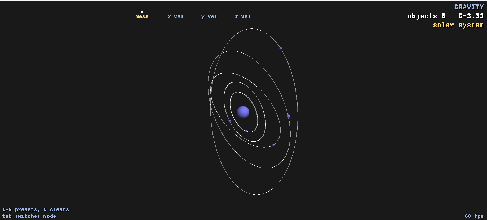
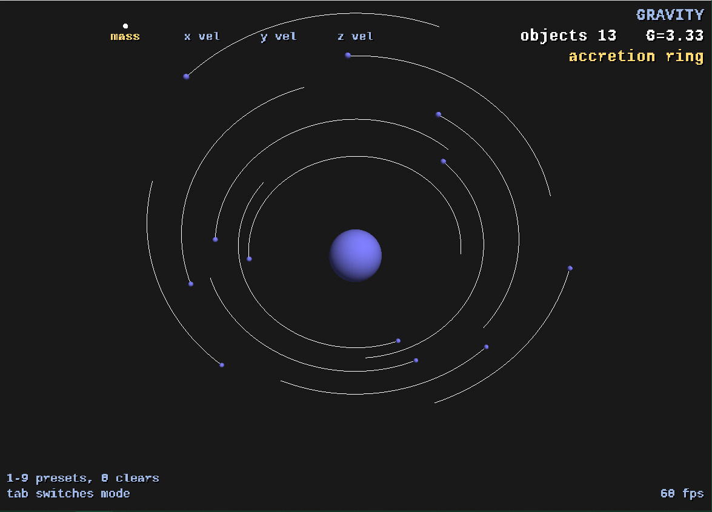
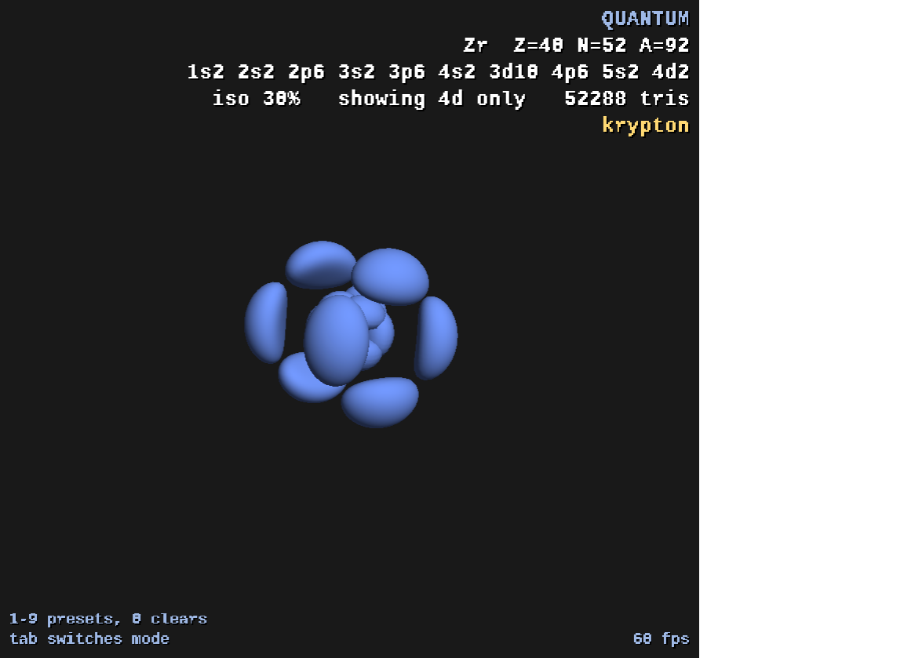

# GravitySim

This is an OpenGL visualization and simulation of classical physics interactions
based on gravity, as well as a semi-rudimentary visualization of electron
orbitals across the periodic table. The current version also carries the flags
and platform shims needed to port it to the web via Emscripten, so the same
source tree builds twice:

```
Visual Studio project  ->  Emscripten  ->  WebAssembly + WebGL2
```

The gravity side is an N-body sandbox: spawn bodies, give them initial
velocities, and watch them orbit, collide, and slingshot. The quantum side
solves screened-hydrogenic wavefunctions and draws |psi|^2 isosurfaces with
marching tetrahedra, so the shapes on screen are the real orbitals for whichever
element is loaded, filled in aufbau order with the Pauli exclusion principle and
Hund's rule.

## Try it in your browser

Check out my most recent port to the web
[here](https://owennaberhaus.com/gravitysim)!

No install, no download. On a phone it runs itself: tap anywhere to step through
the scenes.

## Instructions for use

Everything below is printed to the console when the desktop build starts.

```
right click to spawn in a movable object, left click for immovable
Masses will be equal to the leftmost (blue) reference object
second reference object is initial x velocity, then initial y velocity and finally initial z
Green means positive velocity while red means negative
Arrow keys to switch reference object and to resize
'B' to flip init vel sign, 'G' to turn off gravity, 'V' to toggle initial velocities
WASD to orbit camera, Q/E to roll, 'R' to level out, scroll wheel to zoom
hover an object (it brightens) and press SPACE to delete it
+ and - to increase and reduce the gravitational constant
objects will spawn on the plane normal to the camera direction, that crosses (0, 0, 0)
esc key to pause the whole simulation
keys 1 to 9 load preset scenes, 0 clears back to an empty sandbox
tab to switch between the gravity sim and quantum mode
When in quantum mode, use '[' and ']' to adjust the statistical area of electron presence rendered

-- quantum mode --
left click steps up the periodic table, right click steps back down
hold shift to jump ten elements at a time
  (neutral atom, filled in aufbau order with Pauli and Hund)
'I' cycles the view: valence shell -> all shells -> one shell at a time
'C' clears back to hydrogen
'-' and '=' change how far the nucleus is exaggerated
'[' and ']' thin or fatten the orbital surfaces
scroll to zoom, 'F' refits the view to the atom
tab returns to the gravity sim
```

### Preset scenes

Keys 1 through 9 load a canned scene for whichever mode is showing, and 0 clears
back to an empty sandbox.

| key | gravity | quantum |
| --- | --- | --- |
| 1 | figure eight | hydrogen |
| 2 | solar system | carbon |
| 3 | binary star | nitrogen |
| 4 | earth and moon | neon |
| 5 | comets | iron |
| 6 | planet in a binary | copper |
| 7 | double binary | krypton |
| 8 | cluster collapse | gadolinium |
| 9 | accretion ring | uranium |

## Building

**Desktop.** Open `Attempt2.slnx` in Visual Studio and build. Dependencies live
in `Attempt2/dependencies`.

**Web.** From WSL, with the Emscripten SDK on your path:

```bash
source ~/emsdk/emsdk_env.sh
bash Attempt2/web/build.sh
emrun --no_browser --port 8080 ~/gsbuild/gravitysim.html
```

See `Attempt2/web/README.md` for the details, including why the deployed files
are flat rather than in a folder.

## Have at it

Go ahead and play around with this. If you're so inclined, download the repo and
just start messing with things! I'd love to see anything you come up with —
please hit my line at [owennaberhaus.com](https://owennaberhaus.com).

## A few looks at it



*A fixed star with five planets, two of them on inclined orbits. The trails make
the periods legible — the innermost planet laps the outermost several times over.*



*Twelve test particles on circular orbits at different radii. Orbital speed goes
as 1/sqrt(r), so the ring shears itself into a spiral — Kepler's third law drawn
rather than stated.*



*Quantum mode showing the 4d subshell of zirconium. The surface encloses 30% of
the probability density, found by marching tetrahedra over a sampled grid of
|psi|^2. Press `[` and `]` to make it thinner or fatter.*
